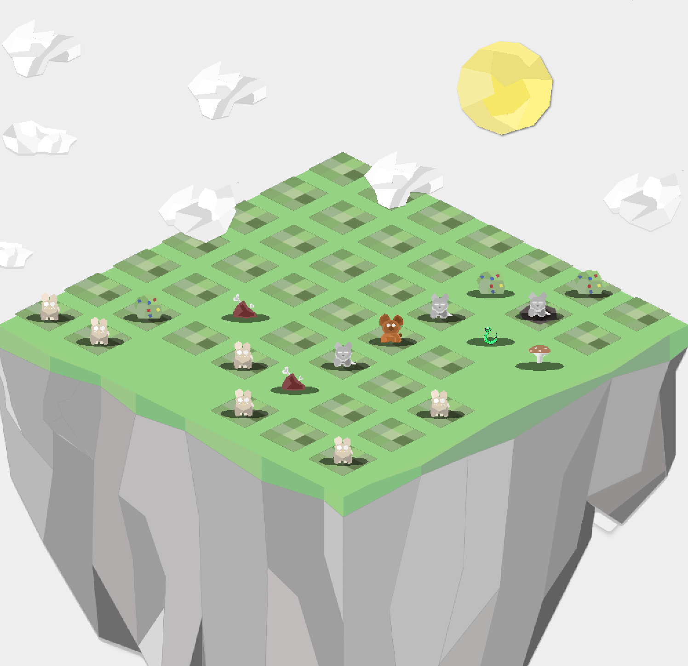
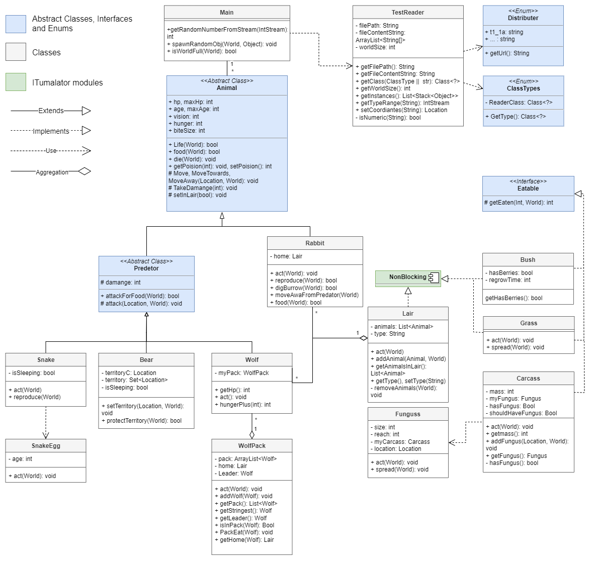

# MinituareWorld
A miniature world simulation, with the use of ITU's simulation library.

## Showcase

## How to run
1. Clone the repository
``$ git clone https://github.com/johannes67890/MiniatureWorld.git``
2. Open the project
3. Run the `Main` class

## Contributors 
- [Johannes Jørgensen](https://github.com/johannes67890)
- [Elias Lildholdt](https://github.com/Spurberino)
- [Frederik Buur](https://github.com/Frededb)

## Documentation
- [Project report](./docs/projectReport/ProjectReport.pdf) 
- [Diary](./docs/projectDiary/diary.pdf)

## UML Class diagram
